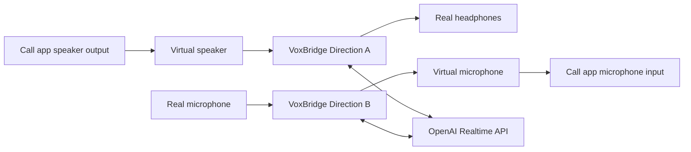

<div align="center">
  

  <h1>VoxBridge</h1>
  <p><b>Realtime speech translation routing between virtual audio devices in calls.</b></p>
  <p>
    <a href="README.ru.md">🇷🇺 Читать на русском</a>
  </p>
</div>

VoxBridge captures audio from one device, streams it to the OpenAI Realtime API, and plays the translated speech into another device. It can run two directions at once, making it the perfect bridge for call setups built around a virtual speaker and a virtual microphone.

<p align="center">
  
</p>

## 🚀 Features

- **Cross-platform GUI**: Built with PySide6 for Windows, macOS, and Linux.
- **Bi-directional Translation**: Run two independent translation routes simultaneously.
- **Low Latency streaming**: Powered by the OpenAI Realtime Translation WebSocket API.
- **Automatic Language Detection**: Translates source language seamlessly.
- **Local Audio Routing**: Deep integration with PortAudio/sounddevice to pipe audio anywhere.

---

## 💸 Cost-Efficiency

VoxBridge uses the newest [gpt-realtime-translate](https://developers.openai.com/api/docs/models/gpt-realtime-translate) model directly with your own API key. Because you pay OpenAI directly without any intermediaries, the pricing is incredibly low—a typical one-hour conversation on Zoom will cost you only about **$2-4**!

---

## 🛠️ Typical Routing Setup

VoxBridge sits between your physical devices and your call application (Zoom, Discord, Teams, etc.).

For a typical English ↔ Russian call:



1. Configure your **Call App speaker output** to a Virtual Speaker.
2. Configure your **Call App microphone input** to a Virtual Microphone.
3. In **VoxBridge Direction A**: Capture the Virtual Speaker and play the translated audio to your Real Headphones.
4. In **VoxBridge Direction B**: Capture your Real Microphone and play the translated audio to the Virtual Microphone.

> [!WARNING]
> Avoid routing VoxBridge's output back into its own input, or the translator will hear itself and create an echo loop!

---

## 🎧 Virtual Audio Devices Setup

To use VoxBridge effectively, you need OS-level virtual audio devices. Here is how to set them up for each operating system:

### Windows

You have several excellent options on Windows:

1. **VB-CABLE (Recommended)**: 
   - Download [VB-CABLE](https://vb-audio.com/Cable/) and install it.
   - It will provide a "CABLE Input" (Virtual Speaker) and "CABLE Output" (Virtual Mic).
   - You can install additional cables (A/B/C/D) if you need more routing separation.
2. **SteelSeries Sonar**: Included in SteelSeries GG, offers extensive virtual routing.
3. **VoiceMeeter**: For advanced users who need complex mixing.

### macOS

1. **BlackHole (Recommended)**:
   - Install via Homebrew: `brew install blackhole-2ch`
   - Alternatively, download from [Existential Audio](https://existential.audio/blackhole/).
   - It creates a seamless loopback device.
2. **Loopback by Rogue Amoeba**: A premium, visual routing tool.

### Linux

Linux users can use native tools for PipeWire or PulseAudio:

**PipeWire (Modern Linux)**
Create virtual sinks and sources using `pw-cli` or `pactl`:
```bash
# Create a virtual sink (Speaker)
pactl load-module module-null-sink sink_name=VirtualSpeaker sink_properties=device.description=VirtualSpeaker
# Create a virtual source (Microphone)
pactl load-module module-virtual-source source_name=VirtualMic master=VirtualSpeaker.monitor
```

---

## 📦 Installation & Running

Python 3.11+ is recommended.

```powershell
# Clone the repository
git clone https://github.com/yourusername/VoxBridge.git
cd VoxBridge

# Create a virtual environment
python -m venv .venv

# Activate the virtual environment
# On Windows:
.\.venv\Scripts\Activate.ps1
# On Linux/macOS:
source .venv/bin/activate

# Install dependencies
python -m pip install -U pip
python -m pip install -e .[build]
```

> [!NOTE]
> On Linux, you must install PortAudio development headers first: `sudo apt install portaudio19-dev`

### Running the App

```powershell
python -m voxbridge
```
You can set your OpenAI API key directly in the app GUI or through the `OPENAI_API_KEY` environment variable.

---

## 🏗️ Building Executables

You can package VoxBridge into a standalone executable using PyInstaller. **Builds must be produced on the target OS** (e.g., build on Windows for a Windows `.exe`).

```powershell
pyinstaller VoxBridge.spec
```

The standalone application will be generated in the `dist/` folder.

---

## ☕ Support the Project

If you find VoxBridge useful, consider buying me a coffee to support further development:

[](https://ko-fi.com/ml_jedi)

---

## 📝 License
MIT License. See `LICENSE` for more information.
