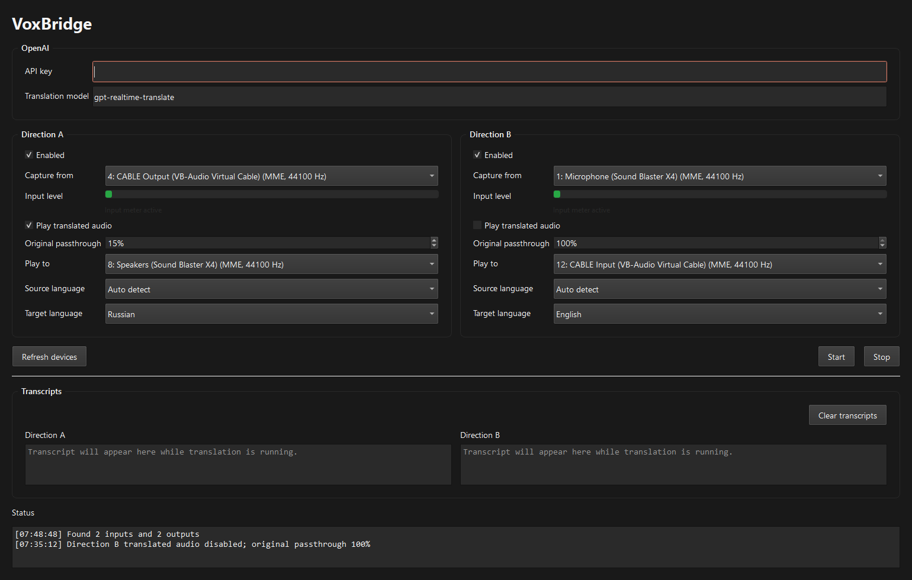
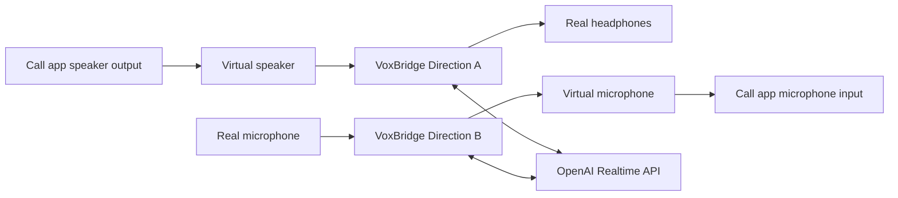
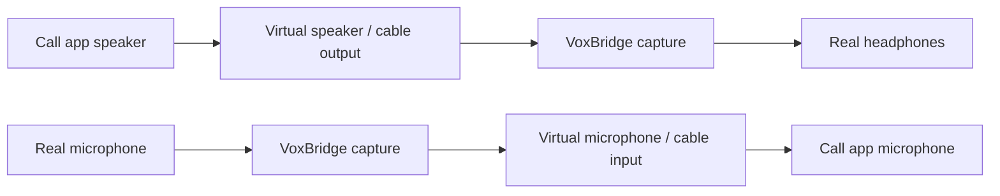

<div align="center">
  

  <h1>VoxBridge</h1>
  <p><b>Realtime speech translation routing between virtual audio devices in calls.</b></p>

  <p>
    <a href="README.ru.md">🇷🇺 Читать на русском</a>
  </p>

<p>
  
  
  
  
</p>

<p>
  <a href="https://github.com/dDoom/VoxBridge/releases/latest" class="btn btn-primary">⬇️ Download Latest Release</a>
  <a href="https://ko-fi.com/ml_jedi" class="btn btn-secondary">☕ Buy me a coffee</a>
</p>
</div>

---

VoxBridge captures audio from one device, streams it to the OpenAI Realtime API, and plays the translated speech into another device. It can run two directions at once, making it the perfect bridge for call setups built around a virtual speaker and a virtual microphone.

<p align="center">
  
</p>

---

## 🚀 Why VoxBridge?

**The problem:** You have a Zoom call with someone who doesn't speak your language. Interpreter services charge $50-100/hour. Browser-based translation tools introduce 5-10 second delays and require weird workarounds.

**The VoxBridge way:** Run a local desktop app. Pair it with free virtual audio cables. Pay OpenAI directly. Get sub-second latency. Total cost: **$2-4 per hour-long call.**

---

## 🎛️ Quick Start



For a typical English ↔ Russian call:

1. **Set up virtual audio devices** (see [Virtual Audio Setup](#-virtual-audio-devices-setup))
2. **Download the latest release** or run from source:
   - **Pre-built executables:** [Releases](https://github.com/dDoom/VoxBridge/releases/latest)
   - **Python source:** `python -m voxbridge`
3. **Open VoxBridge** and configure:
   - **Direction A:** Virtual Speaker → Your Real Headphones
   - **Direction B:** Your Real Microphone → Virtual Microphone
4. **Start translating** and talk normally

> [!WARNING]
> Avoid routing VoxBridge's output back into its own input, or the translator will hear itself and create an echo loop!

---

## 🚀 Features

- **Cross-platform GUI**: Built with PySide6 for Windows, macOS, and Linux.
- **Bi-directional Translation**: Run two independent translation routes simultaneously.
- **Low Latency streaming**: Powered by the OpenAI Realtime Translation WebSocket API.
- **Automatic Language Detection**: Translates source language seamlessly.
- **Subtitle-only mode**: Disable translated audio playback per direction, keep transcripts, and pass through the original audio at a configurable volume.
- **Local Audio Routing**: Deep integration with PortAudio/sounddevice to pipe audio anywhere.
- **Standalone Executables**: Download `.exe` (Windows), `.app` (macOS), or `.tar.gz` (Linux) — no Python needed.

---

## 💸 Cost Comparison

| Method | Price / hour | Latency | Setup time |
|--------|-------------|---------|------------|
| Human interpreter | $50-100 | Near zero | Scheduling required |
| Google Translate (browser) | Free | 5-10s | Audio routing nightmare |
| Commercial AI translation apps | $5-20 | 1-3s | Account + subscription |
| **VoxBridge + OpenAI** | **$2-4** | **<1s** | **10 min initial setup** |

VoxBridge uses the newest [gpt-realtime-translate](https://developers.openai.com/api/docs/models/gpt-realtime-translate) model directly with your own API key. Because you pay OpenAI directly without any intermediaries, the pricing is incredibly low—a typical one-hour conversation on Zoom will cost you only about **$2-4**!

---

## 🛠️ Typical Routing Setup

VoxBridge sits between your physical devices and your call application (Zoom, Discord, Teams, etc.).

For a typical English ↔ Russian call:


1. Configure your **Call App speaker output** to a Virtual Speaker.
2. Configure your **Call App microphone input** to a Virtual Microphone.
3. In **VoxBridge Direction A**: Capture the Virtual Speaker and play the translated audio to your Real Headphones.
4. In **VoxBridge Direction B**: Capture your Real Microphone and play the translated audio to the Virtual Microphone.

> [!WARNING]
> Avoid routing VoxBridge's output back into its own input, or the translator will hear itself and create an echo loop!

---

## 🎧 Virtual Audio Devices Setup

To use VoxBridge effectively, you need OS-level virtual audio devices. Here is how to set them up:



### Windows

1. **VB-CABLE (Recommended)**: 
   - Download [VB-CABLE](https://vb-audio.com/Cable/) and install it.
   - It will provide a "CABLE Input" (Virtual Speaker) and "CABLE Output" (Virtual Mic).
   - You can install additional cables (A/B/C/D) if you need more routing separation.
2. **SteelSeries Sonar**: Included in SteelSeries GG, offers extensive virtual routing.
3. **VoiceMeeter**: For advanced users who need complex mixing.

### macOS

1. **BlackHole (Recommended)**:
   - Install via Homebrew: `brew install blackhole-2ch`
   - Alternatively, download from [Existential Audio](https://existential.audio/blackhole/).
   - It creates a seamless loopback device.
2. **Loopback by Rogue Amoeba**: A premium, visual routing tool.

### Linux

**PipeWire (Modern Linux)**
Create virtual sinks and sources using `pw-cli` or `pactl`:
```bash
# Create a virtual sink (Speaker)
pactl load-module module-null-sink sink_name=VirtualSpeaker sink_properties=device.description=VirtualSpeaker

# Create a virtual source (Microphone)
pactl load-module module-virtual-source source_name=VirtualMic master=VirtualSpeaker.monitor
```

---

## 📦 Installation

### Option A: Download Pre-built Executable (Recommended)

Head to [Releases](https://github.com/dDoom/VoxBridge/releases) and grab the binary for your OS:
- `VoxBridge-v*.windows-x64-portable.exe`
- `VoxBridge-v*.macos-arm64.zip` (Apple Silicon)
- `VoxBridge-v*.macos-intel.zip` (Intel Mac)
- `VoxBridge-v*.linux-x64.tar.gz`

No Python installation required — just download and run.

### Option B: Install from Source

Python 3.11+ is recommended.

```bash
# Clone the repository
git clone https://github.com/dDoom/VoxBridge.git
cd VoxBridge

# Create a virtual environment
python -m venv .venv

# Activate the virtual environment
# On Windows:
.\.venv\Scripts\Activate.ps1
# On Linux/macOS:
source .venv/bin/activate

# Install dependencies
python -m pip install -U pip
python -m pip install -e .[build]
```

> [!NOTE]
> On Linux, you must install PortAudio development headers first: `sudo apt install portaudio19-dev`

### Running the App

```bash
python -m voxbridge
```

You can set your OpenAI API key directly in the app GUI or through the `OPENAI_API_KEY` environment variable.

---

## 🏗️ Building from Source

You can package VoxBridge into a standalone executable using PyInstaller.

```bash
pyinstaller VoxBridge.spec
```

The standalone application will be generated in the `dist/` folder. **Builds must be produced on the target OS** (e.g., build on Windows for a Windows `.exe`).

---

## 🗺️ Supported Platforms

| Platform | Status | Download |
|----------|--------|----------|
| Windows 10/11 | ✅ Full support | [Windows x64](https://github.com/dDoom/VoxBridge/releases/latest) |
| macOS (Apple Silicon) | ✅ Full support | [macOS ARM64](https://github.com/dDoom/VoxBridge/releases/latest) |
| macOS (Intel) | ✅ Full support | [macOS Intel](https://github.com/dDoom/VoxBridge/releases/latest) |
| Linux (x64) | ✅ Full support | [Linux x64 tar.gz](https://github.com/dDoom/VoxBridge/releases/latest) |

---

## 🛠️ Troubleshooting

**Echo loop / audio feedback**
- Make sure VoxBridge output is NOT routed back to its input via the same virtual device.
- Use separate cables for each direction (e.g., VB-CABLE A for Direction A, VB-CABLE B for Direction B).

**No audio in Zoom/Teams**
- Verify your call app's mic input is set to the virtual microphone, not your real mic.
- In Zoom: Settings → Audio → Microphone → Select "CABLE Output" or "VirtualMic".

**High latency**
- Check your internet connection. OpenAI Realtime API needs stable WebSocket connection.
- Try lowering packet buffer size in VoxBridge settings (if available in future versions).

**Linux — no audio devices detected**
- Install PortAudio headers: `sudo apt install portaudio19-dev`
- Restart PulseAudio/PipeWire: `systemctl --user restart pipewire`

---

## 🧩 Architecture

VoxBridge sits between your physical devices and your call application (Zoom, Discord, Teams, etc.).

For a typical English ↔ Russian call:
1. Configure your **Call App speaker output** to a Virtual Speaker.
2. Configure your **Call App microphone input** to a Virtual Microphone.
3. In **VoxBridge Direction A**: Capture the Virtual Speaker and play the translated audio to your Real Headphones.
4. In **VoxBridge Direction B**: Capture your Real Microphone and play the translated audio to the Virtual Microphone.

---

## ☕ Support the Project

If you find VoxBridge useful, consider supporting further development:

- **[GitHub Sponsors](https://github.com/sponsors/dDoom)** — Recurring monthly donations directly through GitHub (no fees).
- **[Ko-fi](https://ko-fi.com/ml_jedi)** — One-time coffee contributions.

[](https://ko-fi.com/ml_jedi)

---

## 📝 License

MIT License. See [LICENSE](LICENSE) for more information.

---

<p align="center">
  Made with ❤️ by <a href="https://github.com/dDoom">dDoom</a>
</p>
