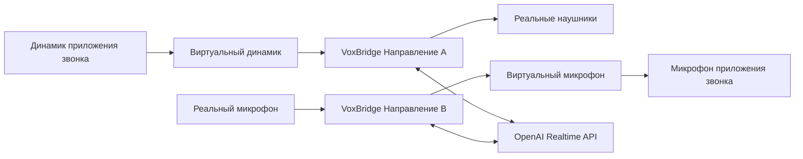

<div align="center">
  

  <h1>VoxBridge</h1>
  <p><b>Маршрутизация и перевод речи в реальном времени между виртуальными аудиоустройствами во время звонков.</b></p>
  <p>
    <a href="README.md">🇬🇧 Read in English</a>
  </p>
</div>

VoxBridge захватывает звук с одного аудиоустройства, передает его в OpenAI Realtime API и воспроизводит переведенную речь в другое устройство. Приложение способно работать в двух направлениях одновременно, что делает его идеальным мостом (bridge) для звонков, использующих виртуальный динамик и виртуальный микрофон.

<p align="center">
  
</p>

## 🚀 Возможности

- **Кроссплатформенный интерфейс (GUI)**: Написан на PySide6, работает на Windows, macOS и Linux.
- **Двусторонний перевод**: Запускайте два независимых маршрута перевода одновременно.
- **Низкая задержка**: Работает на базе WebSocket потока OpenAI Realtime Translation API.
- **Автоматическое определение языка**: Исходный язык распознается автоматически.
- **Режим только субтитров**: Отключайте озвучку перевода отдельно для каждого направления.
- **Локальная маршрутизация звука**: Глубокая интеграция с PortAudio/sounddevice для перенаправления аудиопотоков.

---

## 💸 Экономичность

VoxBridge использует новейшую модель [gpt-realtime-translate](https://developers.openai.com/api/docs/models/gpt-realtime-translate) напрямую через ваш собственный API-ключ. Поскольку вы платите напрямую OpenAI без посредников, стоимость получается невероятно низкой — часовой разговор по Zoom обойдется вам всего примерно в **$2-4**!

---

## 🛠️ Типовая маршрутизация

VoxBridge работает как прослойка между вашими физическими устройствами и приложением для звонков (Zoom, Discord, Teams и т.д.).

Пример для звонка Английский ↔ Русский:



1. Настройте **динамик в приложении для звонков** на вывод в Виртуальный Динамик.
2. Настройте **микрофон в приложении для звонков** на ввод с Виртуального Микрофона.
3. В **VoxBridge Направление A**: Захватывайте звук с Виртуального Динамика и выводите переведенную речь в ваши реальные наушники.
4. В **VoxBridge Направление B**: Захватывайте звук с вашего реального микрофона и выводите переведенную речь в Виртуальный Микрофон.

> [!WARNING]
> Избегайте закольцовывания аудио (routing), чтобы VoxBridge не начал переводить собственный вывод!

---

## 🎧 Настройка виртуальных аудиоустройств

Для полноценной работы VoxBridge требуются виртуальные аудиоустройства (кабели) на уровне операционной системы. Вот как их настроить:

### Windows

Для Windows есть несколько отличных вариантов:

1. **VB-CABLE (Рекомендуется)**: 
   - Скачайте и установите [VB-CABLE](https://vb-audio.com/Cable/).
   - В системе появятся "CABLE Input" (Виртуальный динамик) и "CABLE Output" (Виртуальный микрофон).
   - Вы можете установить дополнительные кабели (A/B/C/D), если вам нужно разделить потоки.
2. **SteelSeries Sonar**: Часть SteelSeries GG, предлагает продвинутую маршрутизацию.
3. **VoiceMeeter**: Для продвинутых пользователей, которым нужен сложный микшер.

### macOS

1. **BlackHole (Рекомендуется)**:
   - Установите через Homebrew: `brew install blackhole-2ch`
   - Или скачайте с [Existential Audio](https://existential.audio/blackhole/).
   - Программа создает невидимое loopback-устройство в системе.
2. **Loopback от Rogue Amoeba**: Платный, но удобный визуальный инструмент.

### Linux

В Linux можно использовать встроенные средства PipeWire или PulseAudio:

**PipeWire (Современные дистрибутивы Linux)**
Создайте виртуальные устройства с помощью `pw-cli` или `pactl`:
```bash
# Создать виртуальный динамик
pactl load-module module-null-sink sink_name=VirtualSpeaker sink_properties=device.description=VirtualSpeaker
# Создать виртуальный микрофон
pactl load-module module-virtual-source source_name=VirtualMic master=VirtualSpeaker.monitor
```

---

## 📦 Установка и запуск

Рекомендуется Python версии 3.11 или выше.

```powershell
# Клонирование репозитория
git clone https://github.com/yourusername/VoxBridge.git
cd VoxBridge

# Создание виртуального окружения
python -m venv .venv

# Активация виртуального окружения
# В Windows:
.\.venv\Scripts\Activate.ps1
# В Linux/macOS:
source .venv/bin/activate

# Установка зависимостей
python -m pip install -U pip
python -m pip install -e .[build]
```

> [!NOTE]
> В Linux предварительно необходимо установить заголовочные файлы PortAudio: `sudo apt install portaudio19-dev`

### Запуск приложения

```powershell
python -m voxbridge
```
Вы можете указать ваш ключ OpenAI API прямо в графическом интерфейсе или через переменную окружения `OPENAI_API_KEY`.

---

## 🏗️ Сборка исполняемых файлов (.exe / .app)

Вы можете собрать автономное приложение с помощью PyInstaller. **Сборку необходимо производить на той ОС, для которой она предназначена** (например, `.exe` собирается только в Windows).

```powershell
pyinstaller VoxBridge.spec
```

Готовое приложение будет находиться в папке `dist/`.

---

## ☕ Поддержать проект

Если VoxBridge оказался для вас полезен, вы можете поддержать его разработку:

[](https://ko-fi.com/ml_jedi)

---

## 📝 Лицензия
MIT License. Подробнее см. файл `LICENSE`.
